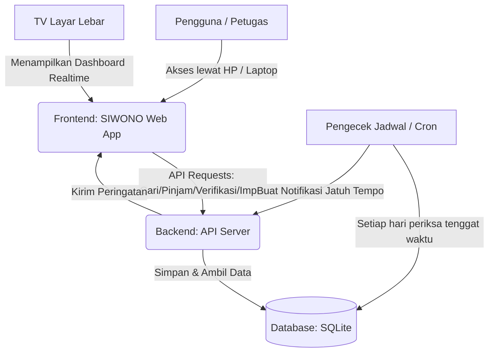
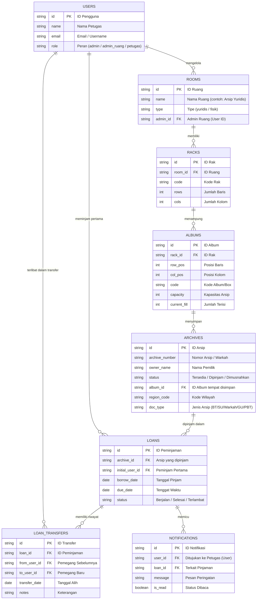

# PRD — Project Requirements Document

## 1. Overview
Saat ini, petugas arsip dan pegawai di Kantor Pertanahan Kabupaten Lamongan masih menggunakan daftar Excel secara manual untuk mencari dan mendata arsip pertanahan (warkah). Proses pencarian fisik arsip ini memakan banyak waktu, dan pengelolaan peminjaman yang manual sering berisiko berkas hilang atau terlambat dikembalikan.

**SIWONO (Aplikasi Warkah Online)** hadir sebagai solusi manajemen arsip pertanahan terpadu. Aplikasi ini bertujuan mendigitalisasi proses kerja di ruang arsip, memungkinkan pencarian arsip secara instan, mencatat riwayat peminjaman dengan sistem peringatan (warning) batas waktu, serta mengelola lokasi rak. Selain dapat diakses melalui ponsel Android untuk mobilitas petugas, SIWONO juga menyediakan dasbor khusus untuk TV layar lebar yang menampilkan pembaruan kondisi ruang arsip secara *real-time*.

Aplikasi ini dirancang untuk menangani dua jenis ruang arsip utama, masing-masing dengan tipe data pertanahan yang khas:
- **Ruang Arsip Yuridis** menyimpan data Buku Tanah (BT), Surat Ukur (SU) yang telah berpasangan dengan BT, dan Warkah (DI208).
- **Ruang Arsip Fisik** menyimpan Surat Ukur (SU) yang belum berpasangan dengan BT, Gambar Ukur (GU), dan Peta Bidang Tanah (PBT).

Seluruh data pertanahan tersebut ditempatkan dalam struktur penyimpanan yang jelas: setiap ruang berisi sejumlah rak yang memiliki kode unik dan di dalam setiap rak terdapat baris serta kolom yang memuat Album atau Box. Satu album/box dapat menampung kumpulan arsip sejenis. Baik ruang yuridis maupun ruang fisik dikelola oleh admin ruang dan petugas ruangnya masing-masing. Setiap arsip memiliki kode wilayah dan kode jenis arsip (BT, SU, Warkah, GU, PBT) yang menjadi kunci identitasnya.

## 2. Requirements
- **Aksesibilitas Multi-Perangkat:** Aplikasi harus mudah dijangkau dari *browser* desktop, layar TV besar, hingga ponsel (HP Android) agar petugas dapat menggunakan aplikasi sambil mengambil arsip di rak.
- **Sistem Peringatan Proaktif:** Harus ada notifikasi visual bagi staf/peminjam mengenai keterlambatan atau batas waktu (jatuh tempo) peminjaman arsip.
- **Dasbor Real-Time Layar Lebar:** Tampilan pemantauan yang mudah dibaca dari kejauhan, menyorot status ketersediaan rak, jumlah arsip, dan aktivitas arsip terbaru di ruang penyimpanan.
- **Pencarian Kilat:** Pencarian arsip berdasarkan Nomor Warkah atau kata kunci lainnya yang mampu memunculkan hasil dalam 1-2 detik.
- **Navigasi Sederhana:** Antarmuka harus sangat mudah dipahami (non-teknis) karena akan digunakan harian oleh petugas operasional kearsipan.
- **Verifikasi Data Arsip Baru:** Setiap penambahan arsip, baik entri manual maupun impor massal, harus melewati proses verifikasi oleh admin ruang untuk memastikan keabsahan dan ketepatan lokasi penyimpanan (ruang, rak, album/box) sebelum data dianggap sah.
- **Pelacakan Peminjaman Real-Time:** Sistem harus mampu melacak rantai penguasaan arsip (*chain of custody*) saat arsip dipinjam dan beralih ke pihak lain, sehingga keberadaan arsip selalu dapat diketahui secara langsung.
- **Integrasi Impor Data Excel (KKP):** Aplikasi harus mendukung unggahan data arsip dalam format Excel yang berasal dari aplikasi KKP (Komputerisasi Kegiatan Pertanahan) untuk mempercepat pemasukan data massal.

## 3. Core Features
Fitur-fitur utama di bawah ini dibagi berdasarkan fase pengembangan yang telah disepakati:

### Fase 1
- **Pencarian Arsip Cepat** [high] — Temukan arsip pertanahan hanya dengan mengetik nomor atau kata kunci, langsung muncul lokasi rak dan statusnya.
  - **Kotak Pencarian Utama:** Tempat mengetik nomor berkas, nama pemilik, atau alamat untuk mencari arsip yang diinginkan.
  - **Daftar Hasil Pencarian:** Menampilkan daftar arsip yang cocok dengan kata kunci, lengkap dengan info singkat seperti nomor, jenis arsip, dan lokasi simpan.
  - **Info Detail & Lokasi Rak:** Menampilkan detail lengkap satu arsip beserta kode ruang, kode rak, baris, kolom, dan album/box, memandu petugas mengambil fisik arsip.
- **Peminjaman Arsip dengan Pelacakan Rantai Penguasaan** [high] — Catat proses pinjam arsip, lengkap dengan data peminjam dan waktu pinjam, sekaligus mendukung pencatatan perpindahan arsip ke pihak lain sebelum dikembalikan (chain of custody), agar status keberadaan arsip selalu terlacak secara *real-time*.
  - **Form Peminjaman:** Formulir untuk mencatat arsip yang dipinjam, nama peminjam, dan jangka waktu peminjaman.
  - **Pencatatan Alih Peminjaman:** Fasilitas untuk mencatat saat arsip berpindah dari peminjam awal ke pihak lain berikutnya, termasuk tanggal dan penanggung jawab baru.
  - **Pelacak Keberadaan Terkini:** Menampilkan riwayat rantai peminjaman dan siapa yang saat ini memegang arsip (jika sedang dipinjam).
  - **Riwayat Peminjaman Saya:** Daftar arsip yang sedang dan pernah dipinjam oleh petugas yang sedang login.
  - **Status & Peringatan Jatuh Tempo:** Menampilkan status pinjaman dan mengirim peringatan jika waktu pinjam sudah atau hampir lewat batas.
- **Dasbor Monitor Ruang Arsip** [high] — Tampilan layar lebar yang memperlihatkan gambaran umum kondisi ruang arsip dan seluruh proses dapur yang terjadi di dalamnya secara *real-time*.
  - **Ringkasan Status Arsip:** Menampilkan angka total arsip, arsip tersedia, dan arsip yang sedang dipinjam, dikelompokkan per jenis arsip dan per ruang.
  - **Peta Keterisian Rak:** Visualisasi denah atau grafik batang yang menunjukkan tingkat kepenuhan setiap rak, lengkap dengan detail album/box yang tersedia.
  - **Aktivitas Terkini:** Daftar *real-time* aktivitas seperti peminjaman baru, pengembalian, alih peminjam, dan arsip masuk/verifikasi, sehingga seluruh gerakan di ruang arsip terpantau langsung.
- **Manajemen Data Arsip** [high] — Tambah, ubah, dan hapus data arsip baru ke dalam sistem, lengkap dengan informasi detail pertanahannya.
  - **Daftar Induk Arsip:** Tabel utama yang berisi seluruh data arsip, bisa diurutkan dan difilter berdasarkan berbagai kolom (kode wilayah, jenis arsip, lokasi, status).
  - **Form Input Arsip Baru:** Formulir untuk mendaftarkan arsip baru ke dalam sistem secara manual saat ada berkas masuk.
  - **Ubah & Arsipkan Data:** Kemampuan untuk mengedit informasi arsip yang salah atau menandai arsip sebagai tidak aktif/dimusnahkan.
- **Impor Data & Verifikasi** [high] — Memungkinkan penambahan data arsip secara massal melalui unggah file Excel dari aplikasi KKP, yang kemudian melalui proses validasi oleh admin ruang.
  - **Unggah Excel KKP:** Halaman untuk mengunggah file Excel berisi data arsip baru; sistem membaca dan menampilkan pratinjau data sebelum disimpan.
  - **Verifikasi oleh Admin Ruang:** Admin ruang (yuridis/fisik) memeriksa keabsahan data impor, mengatur lokasi penempatan (ruang, rak, album/box) untuk setiap arsip, dan mengesahkan data agar masuk ke dalam sistem.
  - **Log Impor & Status:** Riwayat setiap unggahan, jumlah data yang berhasil diverifikasi, dan yang masih menunggu.
- **Manajemen Lokasi Fisik** [high] — Mengelola hirarki penyimpanan arsip mulai dari ruang, rak, hingga album/box agar pencatatan lokasi selalu akurat.
  - **Kelola Ruang:** Mendaftarkan jenis ruang arsip (Yuridis/Fisik) beserta admin ruang yang bertanggung jawab.
  - **Kelola Rak per Ruang:** Menambahkan rak baru ke dalam suatu ruang, menetapkan kode rak, serta mendefinisikan jumlah baris dan kolom yang tersedia.
  - **Kelola Album/Box:** Menentukan kode album/box, menempatkannya pada baris dan kolom tertentu di dalam suatu rak, dan mencatat kapasitas maksimal arsip yang dapat ditampung.
  - **Status Ketersediaan Slot:** Visualisasi dan laporan slot kosong di setiap album/box untuk memudahkan penempatan arsip baru.
- **Notifikasi & Peringatan** [medium] — Kirim peringatan otomatis ke petugas terkait peminjaman yang jatuh tempo atau aktivitas penting lainnya.
  - **Peringatan Jatuh Tempo:** Notifikasi yang muncul saat ada pinjaman arsip yang melewati batas waktu pengembalian.
  - **Riwayat Notifikasi:** Pusat log yang mencatat semua peringatan dan pemberitahuan yang pernah dikirimkan sistem.

### Fase 3
- **Akses & Keamanan** [medium] — Memastikan hanya petugas terdaftar yang bisa masuk ke aplikasi sesuai dengan perannya masing-masing (Admin Ruang Yuridis, Admin Ruang Fisik, Petugas Ruang, atau Administrator Utama).
  - **Daftar Akun Petugas:** Mendaftarkan akun baru untuk setiap petugas yang berwenang menggunakan aplikasi, lengkap dengan penetapan peran dan ruang lingkup aksesnya.
  - **Login & Logout:** Halaman untuk masuk ke dalam aplikasi menggunakan akun yang sudah terdaftar.

## 4. User Flow
1. **Petugas Login:** Petugas membuka aplikasi SIWONO di PC atau HP Android dan melakukan *Login* dengan akun mereka. Sistem akan mengenali peran (Admin Ruang Yuridis, Admin Ruang Fisik, atau Petugas Ruang) dan menampilkan fitur sesuai wewenang.
2. **Lihat Dasbor Layar Lebar:** Pengelola atau kepala arsip membuka *Dashboard Live* yang diproyeksikan ke TV untuk memantau aktivitas keseluruhan (jumlah arsip, rak yang hampir penuh, pergerakan peminjaman) dari seluruh ruang secara *real-time*.
3. **Mencari & Mengambil Arsip:** Petugas mengetikkan Nomor Warkah di *Kotak Pencarian*. Sistem langsung menunjukkan Detail Arsip dan *Lokasi Rak* lengkap (Ruang, Rak, Baris, Kolom, Album/Box). Petugas berjalan ke rak dan album yang ditunjuk untuk mengambil fisik dokumen.
4. **Proses Input Peminjaman:** Setelah fisik arsip ditemukan, petugas mengisi *Form Peminjaman* dengan data peminjam (bisa pegawai di luar petugas arsip) dan jangka waktu. Sistem mencatat rantai peminjaman. Status ketersediaan arsip berubah jadi “Dipinjam” dan terlacak pada peminjam pertama.
5. **Alih Peminjaman (Chain of Custody):** Apabila peminjam menyerahkan arsip ke pihak lain, petugas mencatat *Alih Peminjaman* melalui sistem. Riwayat perpindahan tercatat, dan pelacak keberadaan menunjukkan penguasa terkini hingga arsip kembali ke ruang arsip.
6. **Warning & Pengembalian:** Jika arsip tidak kembali sesuai batas waktu, sistem memunculkan *Notifikasi Peringatan* (Warning) kepada peminjam terakhir dan admin ruang terkait. Setelah arsip dikembalikan, petugas menandai pinjaman selesai dan mengembalikan status arsip ke “Tersedia” di lokasi semula.
7. **Impor Arsip Baru via Excel:** Admin Ruang (Yuridis atau Fisik) mengunggah file Excel data arsip dari KKP ke halaman *Impor Data*. Sistem menampilkan pratinjau. Admin memverifikasi dan menetapkan lokasi (ruang, rak, baris, kolom, album/box) untuk setiap entri, lalu mengesahkan. Data arsip baru resmi tersimpan.
8. **Input Berkas Baru Manual:** Bila ada warkah baru tiba di luar proses impor, petugas menginput data via *Form Input Arsip Baru*. Selanjutnya admin ruang melakukan verifikasi dan menentukan tempat penyimpanan sesuai ketersediaan album/box.

## 5. Architecture
Aplikasi ini akan menggunakan pendekatan *Client-Server Architecture*. *Frontend* akan dioptimalkan sebagai *Progressive Web App* (PWA) agar terasa seperti aplikasi mandiri saat diakses melalui HP Android, serta ramah ukuran layar (responsif) baik untuk *mobile* maupun *Smart TV* layar besar. *Backend* akan menangani pendaftaran arsip baru, manajemen peminjaman, pelacakan rantai penguasaan, dan pemeriksaan keterlambatan peminjaman secara sistematis.

## 6. Database Schema
Untuk merepresentasikan data, kita akan menggunakan 7 tabel utama: *Users*, *Rooms*, *Racks*, *Albums*, *Archives*, *Loans*, *LoanTransfers*, dan *Notifications*.

- **Users**: Menyimpan kredensial dan informasi pegawai. Peran (role) menentukan akses: `admin` (pengelola utama), `admin_ruang` (penanggung jawab ruang yuridis/fisik), dan `petugas` (operator ruang).
- **Rooms**: Mewakili ruang arsip, dengan tipe `yuridis` atau `fisik` serta keterkaitan dengan admin ruang yang ditunjuk.
- **Racks**: Rak di dalam suatu ruang, dilengkapi kode rak dan jumlah baris serta kolom yang tersedia sebagai posisi album.
- **Albums**: Album atau box yang menempati posisi baris/kolom tertentu di dalam rak, memiliki kode unik dan kapasitas arsip.
- **Archives (Warkah)**: Data pokok arsip pertanahan, dilengkapi kode wilayah dan jenis arsip (BT, SU, Warkah, GU, PBT), serta terhubung ke album tempat ia disimpan.
- **Loans**: Mencatat inti transaksi peminjaman awal (peminjam pertama, tanggal pinjam, jatuh tempo).
- **LoanTransfers**: Merekam setiap perpindahan arsip dari satu peminjam ke peminjam lain, mendukung rantai penguasaan.
- **Notifications**: Menyimpan histori peringatan (warning) kepada pengguna.

## 7. Tech Stack
Berdasarkan kebutuhan fungsional dan kecepatan pengembangan yang aman, stabil, dan bisa disesuaikan dengan kebutuhan akses via HP Android maupun Layar Lebar, maka direkomendasikan teknologi berikut:

- **Frontend & Backend Framework:** **Next.js** (Sangat efisien karena satu kode (Fullstack) bisa membangun sisi antarmuka dan API sekaligus. Bisa dijadikan *Progressive Web App* / PWA sehingga bisa di-Install di HP Android tanpa perlu mendaftarkan ke PlayStore).
- **Styling UI:** **Tailwind CSS** dipadukan dengan **shadcn/ui** (Menjamin tampilan visual yang profesional, bersih, dan sangat cepat disesuaikan ukurannya mulai dari HP hingga TV 50 inch).
- **Database:** **SQLite** (Sangat ringan, hemat pemyimpanan, mudah di-backup, sangat cocok untuk aplikasi skala pengelolaan dokumen instansi menengah).
- **Database ORM:** **Drizzle ORM** (Perantara komunikasi antara kode Next.js dengan database SQLite dengan performa yang jauh lebih tinggi dan penulisan lebih mudah).
- **Autentikasi & Keamanan:** **Better Auth** (Implementasi akses *login* petugas yang mudah dikelola, aman, dan ringan).
- **Deployment:** Dapat dipublikasikan secara mandiri di server lokal (On-Premise) menggunakan Docker atau menggunakan layanan *Cloud Host* yang kompatibel dengan Next.js.